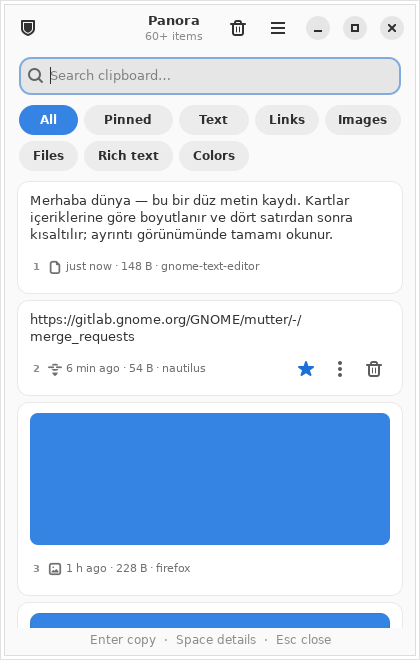
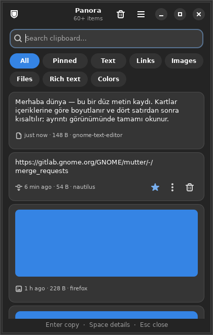
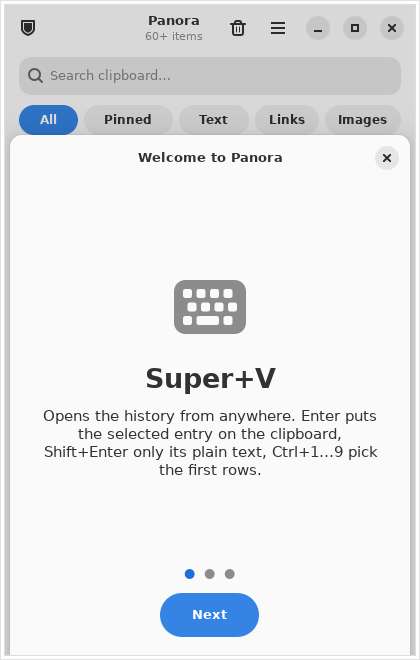

# Panora

[](https://github.com/ygkali/panora/actions/workflows/ci.yml)
[](https://github.com/ygkali/panora/releases)
[](LICENSE)

**Panora** is an encrypted clipboard history for Linux desktops with a
Windows Win+V style popup. It is written in Rust with GTK4/libadwaita, speaks
the X11 and Wayland clipboard protocols natively, never opens a network
connection, and never reads what a password manager copied.

*Türkçe: [README.tr.md](README.tr.md).*

<p align="center">
  
  
  
</p>

> Not to be confused with [Pano](https://github.com/oae/gnome-shell-pano), a
> GNOME Shell extension. Panora is a standalone daemon plus a GTK application;
> its GNOME extension only provides Super+V and a bridge for older GNOME.

## Features

- **Event-driven capture, no helper processes.** `panod` uses XFIXES
  `SelectionNotify` on X11 and `ext-data-control-v1` / `wlr-data-control-v1` on
  Wayland directly (x11rb, wayland-client). No `xclip`, no `wl-clipboard`, no
  polling.
- **TARGETS-first privacy gate.** The offered MIME list is judged before any
  payload is read; content flagged by a password manager
  (`x-kde-passwordManagerHint`, `ConcealedType`, ...) is never transferred.
  KeePassXC, Bitwarden, 1Password and GNOME Secrets are excluded by default;
  the list is editable and applies without a restart.
- **Every format is kept.** Text, HTML/RTF, URI/file lists, PNG/JPEG/WebP/
  BMP/TIFF/GIF/SVG images and colour codes are stored together and offered
  again at once (text + HTML, image); large payloads go through INCR on X11.
- **Clipboard persistence.** When the source application exits, the daemon
  re-offers only what it just recorded, so a password manager clearing the
  clipboard is never undone. On X11 always; on Wayland where the compositor
  drops the selection (Sway, Hyprland and other wlroots desktops), while
  Mutter and KWin keep it themselves (`history.persist_on_wayland`).
- **Encrypted at rest.** Payloads are content-addressed blobs encrypted with
  XChaCha20-Poly1305, previews are AEAD-bound in SQLite, FTS5 prefix search
  narrows as you type. The master key lives in your Secret Service keyring
  and crosses the bus encrypted.
- **Win+V style popup.** A narrow single-column panel: search, type filters
  (text, link, image, file, rich text, colour, pinned), paging, live refresh,
  light/dark, English and Turkish, a settings dialog. Super+V toggles it on
  GNOME; it is a single-instance application with D-Bus activation. Every
  icon button has a screen-reader name, targets are 28 px, fonts follow the
  user's text scale and the layout mirrors for RTL languages.
- **Instant paste** (optional): picking an entry sends Ctrl+V to the focused
  window (XTEST on X11, the Shell extension on GNOME, `wtype`/`ydotool`
  elsewhere).
- **`panora-cli`** with list, search, copy, preview export, pin, private mode,
  status, `--json`, man pages and shell completions; stable exit codes for
  scripting.
- **Sandboxed daemon.** The systemd user unit runs with `ProtectSystem=strict`,
  `ProtectHome=read-only`, `MemoryDenyWriteExecute`,
  `RestrictAddressFamilies=AF_UNIX` and friends.

## Install

Panora needs GTK 4.12 and libadwaita 1.5, so **Debian 13, Ubuntu 24.04, Zorin
OS 18 or newer**. Older releases (Ubuntu 22.04, Zorin OS 17, Mint 21) are not
supported.

### From the Debian package

Download `panora_<version>_<arch>.deb` from the
[releases page](https://github.com/ygkali/panora/releases) (amd64 and arm64),
verify it against `SHA256SUMS`, then:

```sh
sudo apt install ./panora_*.deb
systemctl --user enable --now panod.service
```

On GNOME, log out and back in once so the Shell sees the extension, then:

```sh
gnome-extensions enable panora@ygkali.github.io
```

`panora-doctor` checks the whole setup and tells you what to fix.

### With the installer script

From a checkout or the install kit, `./install.sh` installs the runtime
dependencies, uses the `.deb` in `dist/` when it matches your machine (or
builds one from source, installing rustup into your home if needed), enables
the user service and tries to enable the extension. `./test-local.sh` runs the
doctor and a quick clipboard test afterwards; `./uninstall.sh` removes the
package and keeps your encrypted history unless you pass `--purge-data`.
Messages are English, or Turkish when your locale is Turkish.

### From source

```sh
sudo apt install -y build-essential pkg-config libgtk-4-dev libadwaita-1-dev \
  binutils libglib2.0-bin adwaita-icon-theme librsvg2-common gnome-keyring
git clone https://github.com/ygkali/panora.git && cd panora
./packaging/build-deb.sh          # dist/panora_<version>_<arch>.deb
sudo apt install ./dist/panora_*.deb
```

Rust 1.92 or newer (rustup) is required.

## Use

Open the panel with **Super+V** (GNOME), `panora`, the launcher entry or
`panora-cli toggle`. Opening it again closes it.

| Key | Action |
|---|---|
| `Ctrl+F` | Focus the search box; typing anywhere in the panel also searches |
| `↑ ↓ ← →`, `Home` `End` `PgUp` `PgDn` | Move between entries |
| `Enter` | Put the entry on the clipboard (and paste it when instant paste is on), close |
| `Shift+Enter` | Put only its plain text on the clipboard (drops HTML) |
| `Ctrl+1` … `Ctrl+9` | Pick the Nth entry; the first nine rows show their number |
| `Space` | Details: full text, full-size image, formats |
| `Ctrl+D` | Pin / unpin |
| `Delete` | Delete the entry; the toast offers **Undo** for 30 seconds |
| `Ctrl+Shift+P` | Private mode on / off |
| `Ctrl+,` | Settings |
| `Esc` | Clear the search; close when it is empty |

The panel closes when you switch to another window (like Win+V; a setting
turns that off). The header bar holds the private-mode switch, **clear
history** (pinned entries survive) and the menu with **Settings**. While the
screen is locked nothing is recorded.

### Settings

Written to `~/.config/panora/config.toml` and applied by the daemon on the
spot:

```toml
[history]
record_primary = false   # also record mouse selections (PRIMARY)
max_entries = 1000       # unpinned entries kept
max_age_days = 30        # 0 = forever
max_mime_bytes = 10485760
persist_on_wayland = "auto"   # auto | always | never: re-offer after the source exits
index_full_text = true        # search matches words beyond the 500-char preview
max_total_bytes = 536870912   # payload bytes kept; the oldest unpinned entries go first (0 = no limit)

[privacy]
start_private = false
excluded_apps = ["keepassxc", "bitwarden", "1password", "gnome-secrets"]
min_text_length = 1           # shorter text is not recorded (characters)
ignore_whitespace_only = true
ignore_patterns = []          # regexes; matching text is not recorded, e.g. "^\d{16}$"
capture_kinds = []            # [] = all; or a list of text, richtext, link, image, files, color
sensitive_policy = "mask"     # mask | drop | store: text that looks like a key, token, card or IBAN
sensitive_ttl_minutes = 10    # flagged entries are removed after this long (0 = keep)

[ui]
language = "system"      # system | tr | en
theme = "system"         # system | light | dark
instant_paste = false    # Ctrl+V after picking (Ctrl+Shift+V in terminals)
close_on_focus_loss = true
```

### Search syntax

The search box and `panora-cli search` share one grammar. Words match as
prefixes, `"quoted phrases"` match exactly, and operators narrow the list:

| Operator | Meaning |
|---|---|
| `kind:image` | `text`, `richtext`, `link`, `image`, `files`, `color` |
| `app:firefox` | the source application contains the word (X11 and GNOME) |
| `pinned:yes` / `pinned:no` | pinned or unpinned entries only |
| `after:7d` / `before:2026-09-01` | by last use; `30m`, `12h`, `7d`, `2w` or a day |
| `re:^https?://.*\.pdf$` | the rest of the line is a regular expression (case-insensitive) matched against the preview and the indexed text |

Matches are shown in bold in the popup.

### Command line

```sh
panora-cli list [query] [--kind image] [--pinned] [--limit 20] [--offset 20]
panora-cli search <text>
panora-cli copy <id> [--paste] [--mime text/plain]
panora-cli preview <id> [--mime image/png] [--out photo.png]
panora-cli pin|unpin|delete|restore <id>
panora-cli clear | private on|off | status | toggle | reload
panora-cli store [FILE] [--mime TYPE] [--app NAME] [--no-copy]   # record text from a file or stdin
panora-cli pick [--format '{id}\t{kind}\t{preview}']              # one line per entry for pickers
panora-cli --json status
panora-cli completions bash|zsh|fish
```

Exit status: 0 success, 1 daemon error, 2 usage error, 3 daemon not running,
4 no such entry. `man panora-cli` has the details. A launcher integration is
one line:

```sh
panora-cli pick | fuzzel --dmenu | cut -f1 | xargs panora-cli copy --paste
```

## Desktop support

| Session | Capture | Recall | Source app name | Instant paste |
|---|---|---|---|---|
| X11 (GNOME, Xfce, MATE, i3, ...) | XFIXES events | Native selection owner (INCR) | `_NET_ACTIVE_WINDOW` → `WM_CLASS` | XTEST |
| Wayland, GNOME 48+ | `ext-data-control-v1` | Native data source | Shell extension | Shell extension |
| Wayland, GNOME ≤ 47 (Zorin OS 18) | Shell extension (D-Bus push) | Shell extension, **one format per recall** | Shell extension | Shell extension |
| Wayland, KDE / Sway / Hyprland / ... | `ext` / `wlr-data-control` | Native data source | Not exposed by the protocol (MIME gate still applies) | `wtype` / `ydotool` if installed |

Details, including what each backend can and cannot do, are in
[docs/protocol-matrix.md](docs/protocol-matrix.md).

## Privacy and security

- Password managers' secret markers and the exclusion list are enforced on
  the MIME/TARGETS list before a payload is read. Private mode stops recording
  entirely and survives configuration reloads.
- On plain Wayland compositors the protocol does not tell which application
  owns the clipboard, so the exclusion list cannot fire there; `panora-cli
  status` reports `source_app=false` and the settings dialog says so next to
  the list. The MIME gate works everywhere.
- Storage: XChaCha20-Poly1305 with a versioned envelope and associated data,
  master key in the Secret Service over an encrypted D-Bus session
  (`dh-ietf1024-sha256-aes128-cbc-pkcs7`; the daemon refuses to start
  without it), directories 0700, files 0600, IPC socket 0600 with peer UID
  checks and frame/request limits, GNOME bridge pushes accepted only from
  `org.gnome.Shell`. A database opened with a different key is refused with a
  clear message instead of showing garbage.
- Deleted entries' blobs are removed from disk unless another entry shares
  them; retention runs on every store and hourly.

This is not an independent audit. The kernel, swap, core dumps, a malicious
GNOME extension and an already compromised session are outside the threat
model; see [SECURITY.md](SECURITY.md), the ADRs in `docs/adr/` and
[docs/security-checklist.md](docs/security-checklist.md). RustSec
`cargo-audit` and `cargo-deny` gate every CI run.

## Troubleshooting

`panora-doctor` first; `panora-doctor --report` writes the file to attach to
a bug report. Common cases and the daemon log are described in
[docs/TROUBLESHOOTING.md](docs/TROUBLESHOOTING.md).

## Project

- [docs/ROADMAP.md](docs/ROADMAP.md): what is planned, with an id per task.
- [CHANGELOG.md](CHANGELOG.md), [CONTRIBUTING.md](CONTRIBUTING.md),
  [SECURITY.md](SECURITY.md), [CODE_OF_CONDUCT.md](CODE_OF_CONDUCT.md).
- Architecture: `crates/panora-core` (model, privacy, storage, IPC, i18n),
  `crates/panod` (daemon, backends, keyring, D-Bus), `crates/panora-gui`,
  `crates/panora-cli`, `gnome-extension`, `packaging`.

## License

GPL-3.0-only. See [LICENSE](LICENSE); licences of the statically linked
crates are listed in [THIRD_PARTY_LICENSES.md](THIRD_PARTY_LICENSES.md).
