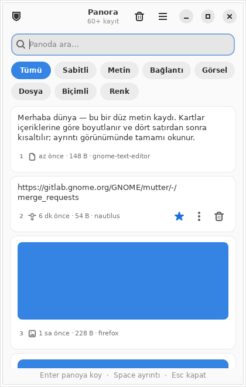

# Panora

*English: [README.md](README.md).*

**Panora**, Linux masaüstleri için Windows Win+V tarzı bir popup'a sahip,
şifreli pano geçmişi yöneticisidir. Rust ve GTK4/libadwaita ile yazılmıştır,
X11 ve Wayland pano protokollerini doğrudan konuşur, hiçbir ağ bağlantısı
açmaz ve parola yöneticilerinin kopyaladığını hiç okumaz. Geçmişi kendi
cihazlarınız arasında yerel ağda senkronlamak isteğe bağlı, ayrı bir
pakettir: `panora-sync` (deneysel; bkz. [docs/SYNC.md](docs/SYNC.md)).
GPL-3.0-only lisanslıdır.

▶ [Popup'ın 45 saniyelik tanıtımı](docs/book/src/media/tour.webm) (WebM,
İngilizce altyazılı; ayrıca [belge sitesinde](https://ygkali.github.io/panora/docs/popup.html)).

<p align="center">
  
  
  
</p>

> GNOME Shell eklentisi olan [Pano](https://github.com/oae/gnome-shell-pano)
> ile karıştırılmasın. Panora bağımsız bir daemon ve GTK uygulamasıdır; GNOME
> eklentisi yalnızca Super+V'yi ve eski GNOME sürümleri için köprüyü sağlar.

## Özellikler

- **Olay tabanlı yakalama, alt süreç yok.** `panod` X11'de XFIXES
  `SelectionNotify`, Wayland'de `ext-data-control-v1` / `wlr-data-control-v1`
  protokollerini doğrudan konuşur (x11rb ve wayland-client). `xclip` veya
  `wl-clipboard` gerekmez, yoklama yapılmaz.
- **TARGETS-önce gizlilik kapısı.** Sunulan MIME listesi payload okunmadan
  değerlendirilir; parola yöneticisi bayrakları (`x-kde-passwordManagerHint`,
  `ConcealedType`, …) taşıyan içerik hiç aktarılmaz. KeePassXC, Bitwarden,
  1Password ve GNOME Secrets varsayılan olarak hariçtir; liste ayarlardan
  genişletilir ve yeniden başlatmadan uygulanır.
- **Tüm biçimler korunur.** Metin, HTML/RTF, URI/dosya listeleri,
  PNG/JPEG/WebP/BMP/TIFF/GIF/SVG görselleri ve renk kodları birlikte saklanır
  ve birlikte geri sunulur (metin + HTML, görsel); büyük payload'lar X11'de
  INCR ile aktarılır. GNOME ≤ 47 köprüsünde geri çağırma tek biçimle sınırlıdır
  (aşağıdaki tabloya bakın).
- **Pano kalıcılığı.** Kaynak uygulama kapanınca daemon yalnızca o an
  kaydettiği içeriği yeniden sunar; parola yöneticilerinin bilinçli
  temizlemeleri geri alınmaz. X11'de her zaman; Wayland'de seçimi düşüren
  bileşim yöneticilerinde (Sway, Hyprland ve diğer wlroots masaüstleri),
  Mutter ve KWin içeriği kendileri korur (`history.persist_on_wayland`).
- **Şifreli depolama.** Payload'lar XChaCha20-Poly1305 ile içerik adresli
  BLOB olarak, önizlemeler AEAD ile bağlanmış şekilde SQLite'ta saklanır;
  FTS5 önek araması yazdıkça daralır. Ana anahtar Secret Service'ten şifreli
  D-Bus oturumuyla alınır.
- **Win+V tarzı popup.** Tek kolonlu dar panel: arama, tür filtreleri (metin,
  bağlantı, görsel, dosya, biçimli, renk, sabitli), sayfalı liste, canlı
  yenileme, açık/koyu tema, Türkçe/İngilizce arayüz, ayarlar penceresi.
  GNOME'da Super+V ile açılıp kapanır; tek örnek uygulama, D-Bus
  etkinleştirme. Simge düğmeleri ekran okuyucu adı taşır, dokunma hedefleri
  28 piksel, yazı boyutları metin ölçeğini izler, arayüz RTL dillerde
  aynalanır.
- **Anında yapıştır** (isteğe bağlı): kayıt seçilince odaktaki pencereye
  Ctrl+V gönderilir (X11'de XTEST, GNOME'da eklenti, diğerlerinde
  `wtype`/`ydotool`).
- **`panora-cli`**: liste, arama, kopyalama, önizleme dışa aktarma,
  sabitleme, özel mod, durum, `--json`, man sayfaları, kabuk tamamlama ve
  betikleme için sabit çıkış kodları.
- **Sandbox'lı daemon.** systemd kullanıcı birimi `ProtectSystem=strict`,
  `ProtectHome=read-only`, `MemoryDenyWriteExecute`,
  `RestrictAddressFamilies=AF_UNIX` ile çalışır.

## Kurulum

Panora GTK 4.12 ve libadwaita 1.5 ister; yani **Debian 13, Ubuntu 24.04,
Zorin OS 18 veya daha yenisi**. Ubuntu 22.04, Zorin OS 17 ve Mint 21
desteklenmez.

### APT deposundan

Sürümler imzalı bir APT deposuna da konur; güncellemeler `apt upgrade` ile
gelir:

```sh
curl -fsSL https://ygkali.github.io/panora/apt/panora.gpg | sudo tee /usr/share/keyrings/panora.gpg >/dev/null
echo "deb [signed-by=/usr/share/keyrings/panora.gpg] https://ygkali.github.io/panora/apt stable main" | sudo tee /etc/apt/sources.list.d/panora.list
sudo apt update && sudo apt install panora
systemctl --user enable --now panod.service
```

### Debian paketiyle

[Sürümler sayfasından](https://github.com/ygkali/panora/releases)
`panora_<sürüm>_<mimari>.deb` dosyasını indirin (amd64 ve arm64),
`SHA256SUMS` ile doğrulayın (bir sürüm anahtarı tanımlıysa minisign ile
imzalı). İkili dosyalar yeniden üretilebilir şekilde ve `cargo auditable`
ile derleniyor (bkz. `docs/RELEASING.md`): `scripts/check-reproducible-
build.sh` etiketlenmiş bir commit'i yeniden derleyip bayt bayt eşleştiğini
doğruluyor, `cargo audit bin panod` ise kaynak ağacına ihtiyaç duymadan bir
ikili dosyanın bağımlılıklarını RustSec danışma veritabanına karşı
kontrol ediyor. Sonra:

```sh
sudo apt install ./panora_*.deb
systemctl --user enable --now panod.service
```

GNOME'da Shell'in eklentiyi görmesi için bir kez oturumu kapatıp açın, sonra:

```sh
gnome-extensions enable panora@ygkali.github.io
```

`panora-doctor` kurulumun tamamını denetler ve ne düzeltileceğini söyler.

### Kurulum script'iyle

Depo klasöründe veya kurulum kitinde `./KUR.sh` (ya da `./install.sh`):
çalışma zamanı bağımlılıklarını kurar, `dist/` içindeki paket makinenize
uyuyorsa onu kullanır (uymuyorsa kaynaktan derler, gerekirse rustup'ı
kullanıcı dizinine indirir), kullanıcı servisini etkinleştirir ve eklentiyi
etkinleştirmeyi dener. `./TEST.sh` doktoru ve hızlı bir pano testi
çalıştırır; `./KALDIR.sh` paketi kaldırır, `--purge-data` verilmedikçe şifreli
geçmişinizi korur. Yerel ayarınız Türkçe ise mesajlar Türkçedir.

### Kaynaktan derleme

```sh
sudo apt install -y build-essential pkg-config libgtk-4-dev libadwaita-1-dev \
  binutils libglib2.0-bin adwaita-icon-theme librsvg2-common gnome-keyring
git clone https://github.com/ygkali/panora.git && cd panora
./packaging/build-deb.sh          # dist/panora_<sürüm>_<mimari>.deb
sudo apt install ./dist/panora_*.deb
```

Rust 1.92 veya daha yenisi (rustup) gerekir.

## Kullanım

Paneli **Super+V** (GNOME), `panora`, uygulama menüsü veya `panora-cli toggle`
ile açın; ikinci çağrı kapatır.

| Kısayol | İşlev |
|---|---|
| `Ctrl+F` | Arama alanına git; panelde herhangi bir harf yazmak da arar |
| `↑ ↓ ← →`, `Home` `End` `PgUp` `PgDn` | Kayıtlar arasında gez |
| `Enter` | Seçili kaydı panoya koy (ayar açıksa yapıştır) ve kapat |
| `Shift+Enter` | Yalnızca düz metnini panoya koy (HTML'i bırakır) |
| `Ctrl+1` … `Ctrl+9` | N. kaydı seç; ilk dokuz satır numarasını gösterir |
| `Space` | Ayrıntı: tam metin, tam boy görsel, biçimler |
| `Ctrl+D` | Sabitle / sabitlemeyi kaldır |
| `Delete` | Kaydı sil; bildirim 30 saniye **Geri al** sunar |
| `Ctrl+Shift+P` | Özel modu aç / kapat |
| `Ctrl+,` | Ayarlar |
| `Esc` | Aramayı temizle; arama boşsa kapat |

Başka bir pencereye geçince panel kapanır (Win+V gibi; ayarlardan
kapatılabilir). Başlık çubuğunda özel mod anahtarı, **geçmişi temizle**
(sabitliler kalır) ve **Ayarlar** menüsü bulunur. Ekran kilitliyken hiçbir
şey kaydedilmez.

### Ayarlar

`~/.config/panora/config.toml` dosyasına yazılır ve daemon'a anında uygulanır:

```toml
[history]
record_primary = false   # fareyle seçilen metni (PRIMARY) de kaydet
max_entries = 1000       # sabitlenmemiş kayıt üst sınırı
max_age_days = 30        # 0 = süresiz
max_mime_bytes = 10485760
persist_on_wayland = "auto"   # auto | always | never: kaynak kapanınca yeniden sun
index_full_text = true        # arama 500 karakterlik önizlemenin ötesini de bulur
max_total_bytes = 536870912   # tutulan içerik baytı; önce en eski sabitlenmemiş kayıtlar gider (0 = sınırsız)
max_images = 200              # tutulan görsel kaydı, önce en eski sabitlenmemişler gider (0 = sınırsız)

[privacy]
start_private = false
excluded_apps = ["keepassxc", "bitwarden", "1password", "org.keepassxc", "com.bitwarden", "secrets"]
excluded_window_titles = []   # ifadeler; odaktaki pencerenin başlığı birini içerirken hiçbir şey kaydedilmez (X11, GNOME)
min_text_length = 1           # daha kısa metin kaydedilmez (karakter)
ignore_whitespace_only = true
ignore_patterns = []          # regex; eşleşen metin kaydedilmez, örn. "^\d{16}$"
capture_kinds = []            # [] = hepsi; ya da text, richtext, link, image, files, color listesi
# mask | drop | store: anahtar, jeton, kart ya da IBAN'a benzeyen metin. "mask" yalnızca
# listede görünen *önizlemeyi* değiştirir; gerçek içerik yine de saklanır ve geri
# çağırma/önizleme/dışa aktarmada başka bir kayıt gibi geri döner — bu bir görünüm
# politikasıdır, sırrı erişilemez kılan bir yöntem değil. Bunun için "drop" kullanın.
sensitive_policy = "mask"
sensitive_ttl_minutes = 10    # işaretli kayıtlar bu kadar dakika sonra silinir (0 = tutulur)
lock_after_idle_minutes = 0   # bu kadar dakika işlem yapılmazsa ikinci katman kilidi devreye girer (0 = asla; SEC-02, önce bir kilit parolası kurulmalı)

[ui]
language = "system"      # system | tr | en
theme = "system"         # system | light | dark
instant_paste = false    # seçince Ctrl+V (terminallerde Ctrl+Shift+V)
close_on_focus_loss = true
position = "pointer"     # pointer | center: panelin açıldığı yer (X11, GNOME)
layer_anchor = "top-right"   # gtk4-layer-shell'li Sway/Hyprland: top-right | top-left | bottom-right | bottom-left | center
```

### Arama söz dizimi

Arama kutusu ve `panora-cli search` aynı dilbilgisini kullanır. Sözcükler ön
ek olarak eşleşir, `"tırnaklı ifadeler"` birebir aranır, işleçler listeyi
daraltır:

| İşleç | Anlamı |
|---|---|
| `kind:image` | `text`, `richtext`, `link`, `image`, `files`, `color` |
| `app:firefox` | kaynak uygulama adı bu sözcüğü içerir (X11 ve GNOME) |
| `pinned:yes` / `pinned:no` | yalnızca sabitli / sabitsiz kayıtlar |
| `after:7d` / `before:2026-09-01` | son kullanıma göre; `30m`, `12h`, `7d`, `2w` ya da bir gün |
| `re:^https?://.*\.pdf$` | satırın kalanı düzenli ifadedir (büyük/küçük harf duyarsız); önizleme ve dizinlenen metinde aranır |

Eşleşmeler popup'ta kalın gösterilir.

### Komut satırı

```sh
panora-cli list [arama] [--kind image] [--pinned] [--limit 20] [--offset 20]
panora-cli search <metin>
panora-cli copy <id> [--paste] [--mime text/plain] [--primary]
panora-cli preview <id> [--mime image/png] [--out foto.png]
panora-cli pin|unpin|delete|restore <id>
panora-cli clear | private on|off | status | stats | toggle | reload
panora-cli config get [ANAHTAR] | set <ANAHTAR> <DEĞER> | validate | edit
panora-cli store [DOSYA] [--mime TÜR] [--app AD] [--no-copy]   # dosyadan / stdin'den metin kaydet
panora-cli pick [--format '{id}\t{kind}\t{preview}']           # seçiciler için satır satır liste
panora-cli --json status
panora-cli completions bash|zsh|fish
```

Çıkış kodları: 0 başarı, 1 daemon hatası, 2 kullanım hatası, 3 daemon
çalışmıyor, 4 kayıt yok. Ayrıntı için `man panora-cli`. Bir başlatıcıya
bağlamak tek satır:

```sh
panora-cli pick | fuzzel --dmenu | cut -f1 | xargs panora-cli copy --paste
```

## Masaüstü uyumluluğu

| Oturum | Yakalama | Geri çağırma | Uygulama adı | Anında yapıştır |
|---|---|---|---|---|
| X11 (GNOME, Xfce, MATE, i3, …) | XFIXES olayları | Yerel selection owner (INCR) | `_NET_ACTIVE_WINDOW` → `WM_CLASS` | XTEST |
| Wayland, GNOME 48+ | `ext-data-control-v1` | Yerel data source | Shell eklentisi | Shell eklentisi |
| Wayland, GNOME ≤ 47 (Zorin OS 18) | Shell eklentisi (D-Bus push) | Shell eklentisi, **geri çağırmada tek biçim** | Shell eklentisi | Shell eklentisi |
| Wayland, KDE / Sway / Hyprland / … | `ext` / `wlr-data-control` | Yerel data source | Protokol sunmaz (MIME kapısı çalışır) | `wtype` / `ydotool` varsa |

Ayrıntılar [docs/protocol-matrix.md](docs/protocol-matrix.md) dosyasında.

## Gizlilik ve güvenlik

- Parola yöneticilerinin gizli işaretleri ve hariç listesi, payload
  okunmadan MIME/TARGETS listesi üzerinde uygulanır. Özel mod kaydı tamamen
  durdurur ve ayar yeniden yüklense de korunur.
- Düz Wayland bileşim yöneticilerinde protokol panonun sahibi uygulamayı
  söylemez; hariç listesi orada devreye giremez, `panora-cli status` bunu
  `source_app=false` ile bildirir ve ayarlar penceresi listenin yanında yazar.
  MIME kapısı her yerde çalışır.
- Depolama: sürümlü zarf ve ilişkili veriyle XChaCha20-Poly1305, Secret
  Service'te tutulan ve şifreli D-Bus oturumuyla alınan ana anahtar
  (`dh-ietf1024-sha256-aes128-cbc-pkcs7`; olmazsa daemon başlamayı reddeder),
  0700 dizinler, 0600 dosyalar, peer UID kontrollü ve sınırlı IPC soketi,
  yalnızca `org.gnome.Shell`'den kabul edilen köprü çağrıları. Başka bir
  anahtarla açılan veritabanı anlamsız içerik göstermek yerine açık bir
  mesajla reddedilir.
- Silinen kayıtların BLOB'ları başka bir kayıt paylaşmıyorsa diskten
  kaldırılır; saklama sınırları her kayıtta ve saatte bir uygulanır.

Bu bağımsız bir denetim değildir. Çekirdek, takas, core dump, kötü amaçlı
GNOME eklentisi ve zaten ele geçirilmiş oturum tehdit modelinin dışındadır;
bkz. [SECURITY.md](SECURITY.md), `docs/adr/` ve
[docs/security-checklist.md](docs/security-checklist.md).

## Sorun giderme

Önce `panora-doctor`; `panora-doctor --report` hata bildirimine eklenecek dosyayı
yazar. GNOME, KDE, Sway/Hyprland ve Xorg masaüstlerinde neyin çalıştığı ve
kısayolun nasıl bağlandığı [docs/DESKTOPS.md](docs/DESKTOPS.md) dosyasında.
Sık karşılaşılan durumlar ve daemon günlüğü için
[docs/TROUBLESHOOTING.md](docs/TROUBLESHOOTING.md).

## Proje

- **[Belge sitesi](https://ygkali.github.io/panora/docs/)**: kullanım
  kılavuzu, `config.toml` ve CLI referansları, arama söz dizimi, gizlilik
  modeli ve masaüstü matrisi; aranabilir (İngilizce). Kaynağı `docs/book/`.
- [docs/ROADMAP.md](docs/ROADMAP.md): planlanan işler, her biri ID'li.
- [docs/DISTRIBUTION.md](docs/DISTRIBUTION.md): resmi dağıtım kanalları,
  test edilen dağıtımlar, destek penceresi ve paketleyiciler için notlar
  (İngilizce).
- [CHANGELOG.md](CHANGELOG.md), [CONTRIBUTING.md](CONTRIBUTING.md),
  [GOVERNANCE.md](GOVERNANCE.md) (İngilizce), [SECURITY.md](SECURITY.md),
  [CODE_OF_CONDUCT.md](CODE_OF_CONDUCT.md).

## Lisans

GPL-3.0-only. Bkz. [LICENSE](LICENSE); statik bağlanan crate'lerin lisansları
[THIRD_PARTY_LICENSES.md](THIRD_PARTY_LICENSES.md) dosyasındadır.
